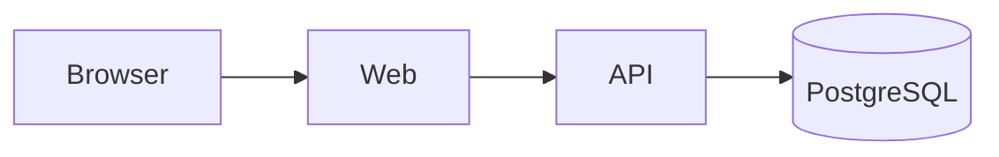

# TriaCli — Clinical Trial Data Dashboard

Full-stack application for visualizing and managing clinical trial participants and metrics.

## Quick start

```bash
cp .env.example .env
docker compose up --build
```

| Service    | URL                            |
| ---------- | ------------------------------ |
| Web        | http://localhost:5173          |
| API        | http://localhost:8000          |
| API docs   | http://localhost:8000/docs     |
| PostgreSQL | localhost:5432                 |

### Login

| Username    | Password   |
| ----------- | ---------- |
| researcher  | password   |

### Protected API example

```bash
TOKEN=$(curl -s -X POST http://localhost:8000/auth/login \
  -H "Content-Type: application/json" \
  -d '{"username":"researcher","password":"password"}' | jq -r '.access_token')

curl -s http://localhost:8000/participants \
  -H "Authorization: Bearer $TOKEN" | jq
```

## Testing

Backend:

```bash
docker compose exec api pytest -v
```

Frontend:

```bash
cd frontend
npm install
npm test
npm run build
```

Or with Make:

```bash
make test
```

## Database access

```bash
docker compose exec db psql -U tria -d tria -c "SELECT * FROM participants;"
```

## Architecture



```
TriaCli/
├── backend/          FastAPI REST API
├── frontend/         React dashboard
├── docker-compose.yml
└── .github/workflows/ci.yml
```

## Stack

| Layer      | Choice              | Why                                      |
| ---------- | ------------------- | ---------------------------------------- |
| Frontend   | React + TypeScript  | Component model, strong typing           |
| Build      | Vite                | Fast dev server and builds               |
| Charts     | Recharts            | Simple charts for trial metrics          |
| Backend    | FastAPI             | OpenAPI docs, Pydantic validation        |
| ORM        | SQLAlchemy          | Mature Postgres integration              |
| Database   | PostgreSQL          | Relational storage for trial data        |
| Auth       | JWT                 | Stateless API-friendly authentication    |
| Containers | Docker Compose      | One-command local environment            |

## Completed

- Docker Compose setup with API, web, and Postgres
- Participant CRUD API with validation
- JWT login and protected routes
- Metrics summary endpoint
- React login, participants list, add form, metrics dashboard
- Backend pytest suite
- Frontend vitest coverage for auth UI
- GitHub Actions CI

## Not implemented

- User registration and role-based access control
- Alembic migrations (tables created on startup)
- Password hashing for demo user
- E2E browser tests
- Production deployment

## Trade-offs

- Single demo user instead of a users table to ship auth quickly
- `create_all` instead of migrations for a small take-home scope
- JWT in localStorage for simplicity over httpOnly cookies
- Recharts over a heavier BI stack for readable trial summaries

## With more time

- User registration, bcrypt passwords, and RBAC
- Alembic migrations and seed data
- Audit log for regulatory traceability
- Refresh tokens and secure cookie storage
- Playwright E2E tests
- Cloud deployment with observability

## AI tools

Cursor was used to accelerate scaffolding and explain code/architecture unknown to me
